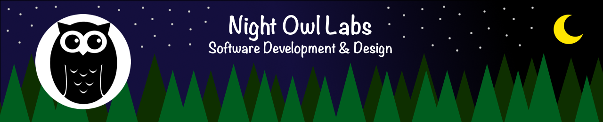

# Hello! Welcome to Night Owl Labs, LLC. 👋

## [Night Owl Labs](https://www.nightowllabs.net)

## IS-A...
- Software Development & Design company.
- Formed in 2014 by [Scott Grivner](https://github.com/scottgriv).
- based in North Eastern Pennsylvania (NEPA), USA.

## HAS-A...
- Goal to conduct research in order to develop open and closed source software on the latest technological trends.
- Goal to create tutorials and learning materials to introduce people to Software Development & Design.

## USES-A...
- Best UI/UX Design Practices.
- OOP, UML, and Architecture Practices.
- AGILE and Waterfall Methodologies.

<h3 align="left"><b>Get in touch!</b></h3>

